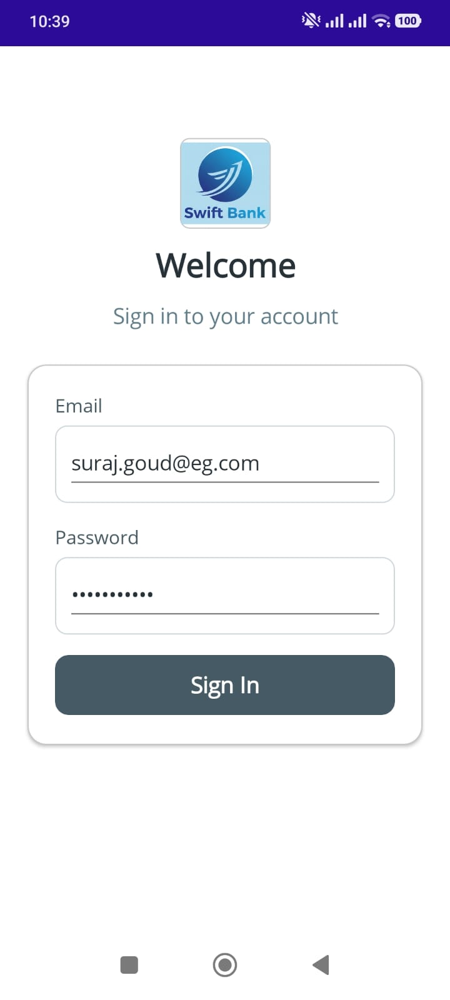
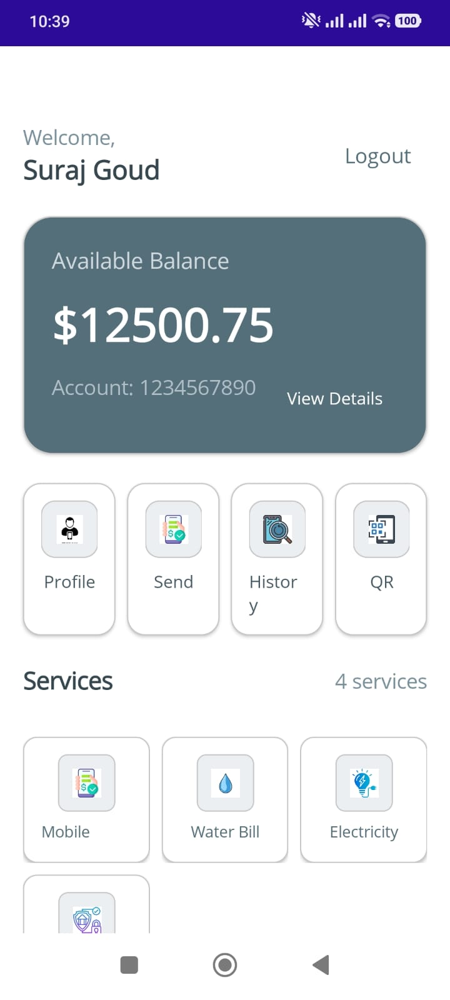
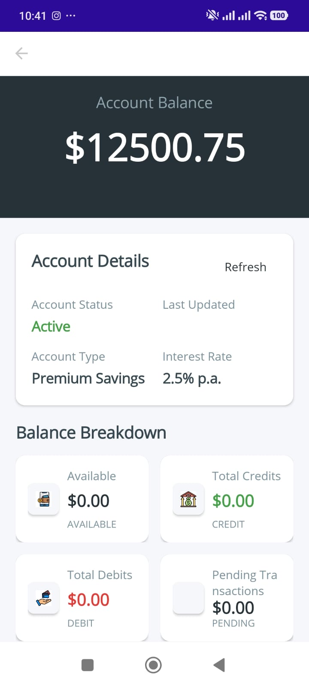
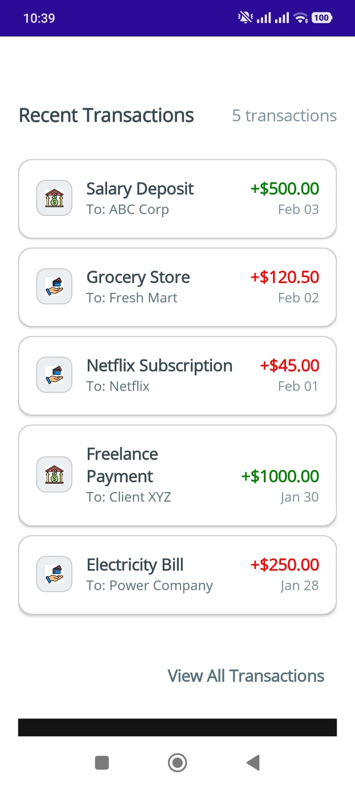

# MAUI Bank App - demo 

Published apk link is [apk for Android](/com.companyname.mauibankapp-Signed.apk)


## 📱 Overview
MAUI Bank App is a modern, cross-platform mobile banking application built with .NET 8 and MAUI (Multi-platform App UI). This application demonstrates modern banking features with a clean, intuitive user interface and robust architecture.

## Architecture Overview

### Technology Stack
- **.NET 8** - Latest .NET framework
- **MAUI (Multi-platform App UI)** - Cross-platform UI framework
- **CommunityToolkit.Mvvm** - MVVM pattern implementation
- **Dependency Injection** - Built-in .NET DI container
- **Repository Pattern** - Clean separation of concerns
- **Mock Services** - For development and testing

### Project Structure
```
MauiBankApp/
├── Views/              # UI Pages (XAML)
├── ViewModels/         # Business logic and state management
├── Models/             # Data models and entities
├── Services/           # Service layer (interfaces and implementations)
├── Converters/         # XAML value converters
├── Extensions/         # Extension methods
└── Resources/          # Images, fonts, styles
```

## Getting Started

### Prerequisites
- **.NET 8 SDK** (8.0 or higher)
- **Visual Studio 2022** (Version 17.8 or higher)
- **Mobile Development with .NET** workload
- **Android/iOS Development Tools** (optional for device deployment)

### Installation Steps

1. **Clone the repository**
   ```bash
   git clone <repository-url>
   cd MauiBankApp
   ```

2. **Restore NuGet packages**
   ```bash
   dotnet restore
   ```

3. **Build the solution**
   ```bash
   dotnet build
   ```

4. **Run the application**
   - **Android Emulator**: Select Android emulator and run
   - **iOS Simulator**: Select iOS simulator and run (macOS only)
   - **Windows**: Select Windows Machine and run

## Data Flow Architecture

### 1. **API Response Pattern**
```csharp
public class ApiResponse<T>
{
    public bool IsSuccess { get; set; }
    public T Data { get; set; }
    public string Message { get; set; }
}
```

### 2. **Dependency Injection Setup** (MauiProgram.cs)
```csharp
public static class MauiProgram
{
    public static MauiApp CreateMauiApp()
    {
        var builder = MauiApp.CreateBuilder();
        
        // Register Services
        builder.Services.AddSingleton<IAuthService, MockAuthService>();
        builder.Services.AddSingleton<ITransactionService, MockTransactionService>();
        builder.Services.AddSingleton<INavigationService, NavigationService>();
        
        // Register ViewModels and Pages
        builder.Services.AddTransient<HomeViewModel>();
        builder.Services.AddTransient<HomePage>();
        // ... other registrations
        
        return builder.Build();
    }
}
```

### 3. **MVVM Data Binding Example**
```xml
<!-- XAML Binding -->
<Label Text="{Binding CurrentUser.Name}" 
       FontSize="20" 
       FontAttributes="Bold"/>

<Label Text="{Binding Balance, StringFormat='${0:F2}'}" 
       FontSize="40" 
       FontAttributes="Bold"/>

<CollectionView ItemsSource="{Binding RecentTransactions}">
    <CollectionView.ItemTemplate>
        <DataTemplate x:DataType="models:Transaction">
            <!-- Transaction item template -->
        </DataTemplate>
    </CollectionView.ItemTemplate>
</CollectionView>
```

## Theme and Design System

### Color Palette
```xml
<!-- Theme Colors -->
<Color x:Key="PrimaryDark">#263238</Color>     <!-- Dark Blue-Grey -->
<Color x:Key="PrimaryLight">#90A4AE</Color>    <!-- Light Blue-Grey -->
<Color x:Key="BackgroundLight">#F5F7FA</Color> <!-- Light Background -->
<Color x:Key="TextPrimary">#37474F</Color>     <!-- Primary Text -->
<Color x:Key="TextSecondary">#78909C</Color>   <!-- Secondary Text -->
<Color x:Key="Success">#43A047</Color>         <!-- Success Green -->
<Color x:Key="Error">#E53935</Color>           <!-- Error Red -->
```

### UI Components
- **Cards**: Rounded corners with shadows
- **Buttons**: Two styles (filled and outlined)
- **Input Fields**: Modern, accessible forms
- **Lists**: Virtualized CollectionViews for performance
- **Loading States**: Skeleton loaders and activity indicators

## Performance Optimizations

### 1. **Async/Await Pattern**
```csharp
[RelayCommand]
private async Task LoadDataAsync()
{
    if (IsBusy) return;
    
    try
    {
        IsBusy = true;
        var response = await _service.GetDataAsync();
        // Process response
    }
    catch (Exception ex)
    {
        // Handle error
    }
    finally
    {
        IsBusy = false;
    }
}
```

### 2. **Data Virtualization**
- Uses `CollectionView` with virtualization
- Lazy loading for transaction history
- Image caching for icons

### 3. **Memory Management**
- Proper disposal of resources
- Weak event patterns
- ObservableCollection for data binding

## Security Features

### 1. **Authentication**
```csharp
// Secure token storage
await SecureStorage.Default.SetAsync("auth_token", token);
var token = await SecureStorage.Default.GetAsync("auth_token");
SecureStorage.Default.Remove("auth_token");
```

### 2. **Data Validation**
- Input validation on all forms
- API response validation
- Error handling and user feedback

## Features Implemented

### Core Banking Features
1. **Account Overview** - View balance and account details
2. **Transaction History** - View and filter transactions
3. **Money Transfer** - Send money to other accounts
4. **Bill Payments** - Pay utility bills (water, electricity)
5. **Mobile Top-up** - Recharge mobile phones
6. **QR Code Payments** - Generate and scan QR codes
7. **Profile Management** - Update user profile
8. **Security Settings** - Manage app security


## 📈 Advantages of .NET MAUI

### 1. **Cross-Platform Development**
- Single codebase for Android, iOS, Windows, and macOS
- Native performance on each platform
- Platform-specific APIs when needed

### 2. **Modern Development Experience**
- Hot Reload for rapid development
- Single project structure
- Built-in dependency injection
- Modern C# features (records, pattern matching)

### 3. **Performance**
- Ahead-of-Time (AOT) compilation
- Minimal runtime overhead
- Native UI controls

### 4. **Productivity**
- Shared business logic
- XAML Hot Reload
- Visual Studio integration
- Extensive NuGet package ecosystem

### 5. **Maintenance**
- Easy updates across all platforms
- Centralized bug fixes
- Simplified testing

## 🚀 Deployment

### Android
```bash
# Build APK
dotnet build -c Release -f net8.0-android

# Build AAB (App Bundle)
dotnet publish -c Release -f net8.0-android -p:AndroidPackageFormat=Bundle
```

### iOS
```bash
# Build for iOS
dotnet build -c Release -f net8.0-ios

# Archive for distribution
dotnet publish -c Release -f net8.0-ios
```

### Windows
```bash
# Build for Windows
dotnet build -c Release -f net8.0-windows10.0.19041.0
```

## 🔗 Useful Links

### Documentation
- [.NET MAUI Documentation](https://docs.microsoft.com/dotnet/maui/)
- [MAUI Community Toolkit](https://github.com/CommunityToolkit/Maui)
- [XAML Hot Reload](https://docs.microsoft.com/dotnet/maui/xaml/hot-reload)

### Tools
- [Visual Studio 2022](https://visualstudio.microsoft.com/vs/)
- [.NET 8 SDK](https://dotnet.microsoft.com/download/dotnet/8.0)
- [Android Emulator](https://developer.android.com/studio/run/emulator)

### Learning Resources
- [MAUI Workshop](https://github.com/dotnet-presentations/dotnet-maui-workshop)
- [MAUI Samples](https://github.com/dotnet/maui-samples)
- [MAUI University](https://www.maui-university.com/)






